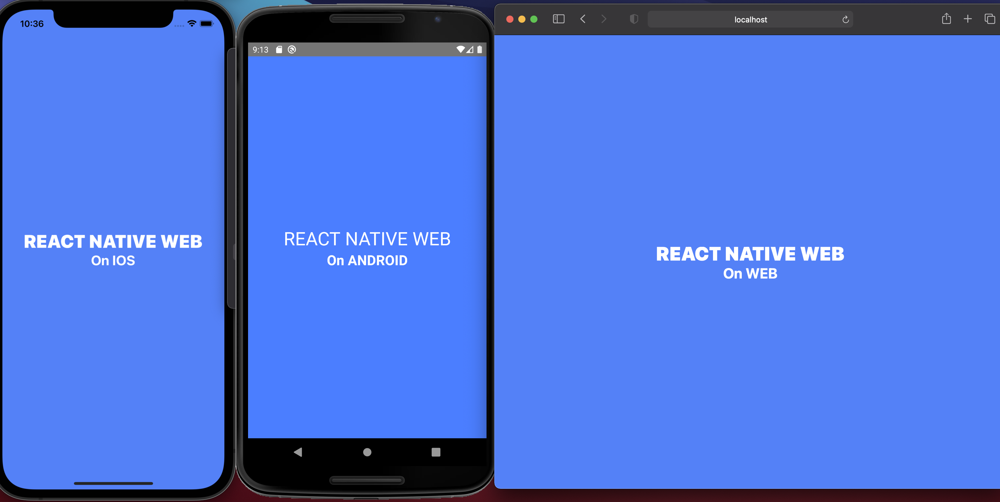

<h1 align="center">full stack monorepo</h1>

# Packages

- mobile - react native
- web - react + nextjs
- backend - hasura + strapi + nestjs

# Frontend



## install

```bash
yarn install --check-file
```

## Usage

```bash
# andriod
yarn android
# ios
yarn ios
# web
yarn web
```

# Backend

# Thanks to

 - @octo-5 - [nextjs-rn-monorepo](https://github.com/octo-5/nextjs-rn-monorepo)
 - @brunolemos - [react-native-web-monorepo](https://github.com/brunolemos/react-native-web-monorepo)
